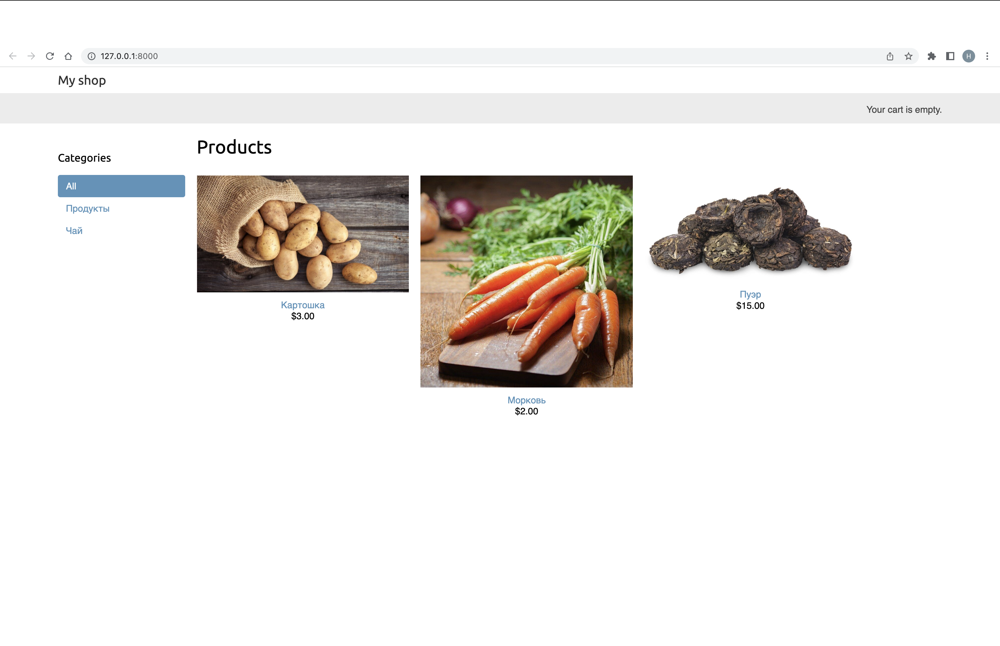
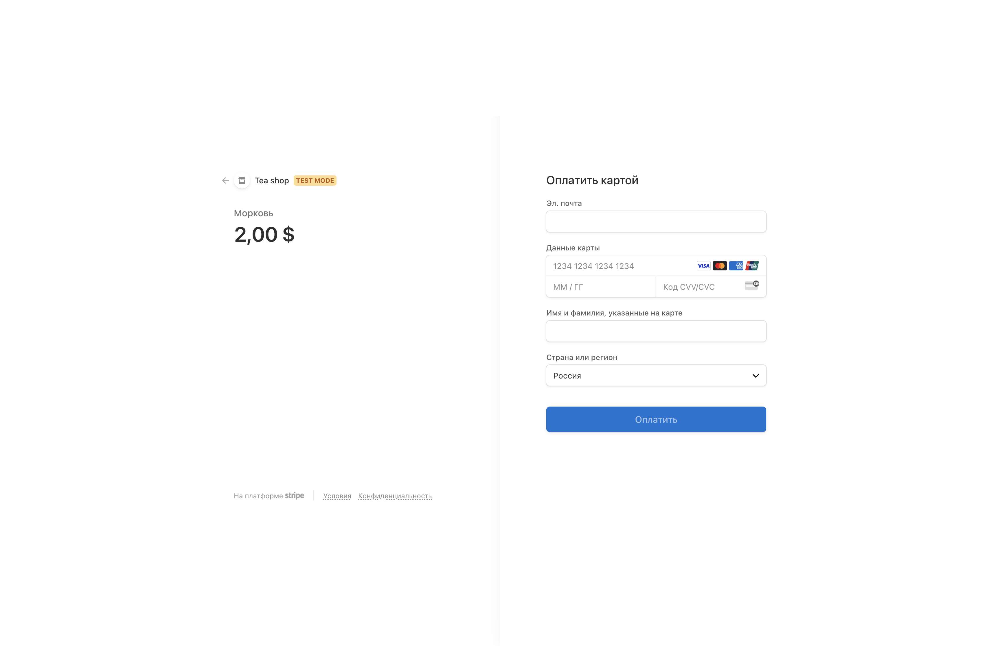
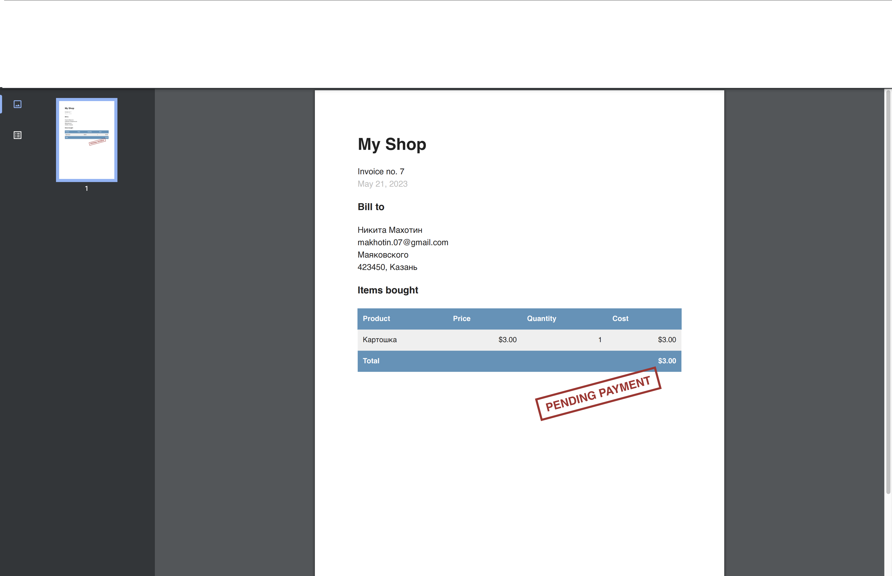

# Django-Shop: 🛍️ Элегантный интернет-магазин с Django 🎁

<div align="center">
  
  <br>
  
  <br>
  
</div>

## О проекте

Добро пожаловать в Django-Shop, пример элегантного и стильного интернет-магазина, созданного с использованием Django. Этот проект разработан с использованием Django 4.1.9 и Python 3.11.

Онлайн-магазин предлагает следующий функционал:

- Каталог товаров с возможностью фильтрации по категориям.
- Система корзины для оформления покупок.
- Интеграция платежей для безопасных транзакций.
- Уведомления по электронной почте об обновлениях заказов.
- Асинхронная обработка задач с помощью Celery и RabbitMQ.
- Динамическое создание отчетов о платежах в формате PDF.
- Экспорт данных заказов в формат CSV.
- Оптимизация внутреннего администрирования для удобного управления.

## Установка

Чтобы начать работу с проектом Django-Shop, выполните следующие шаги:

1. Установите необходимые зависимости, выполнив следующую команду в виртуальном окружении (virtualenv):
   ```bash
   pip install -r requirements.txt
   ```

2. Запустите сервер разработки с помощью следующей команды:
   ```bash
   python manage.py runserver
   ```

## Автор

- **Никита Махотин**

---

Мы надеемся, что вам понравится изучение Django-Shop, элегантного интернет-магазина, созданного с помощью Django. Спасибо за внимание!

Приятных покупок! 🛒✨
